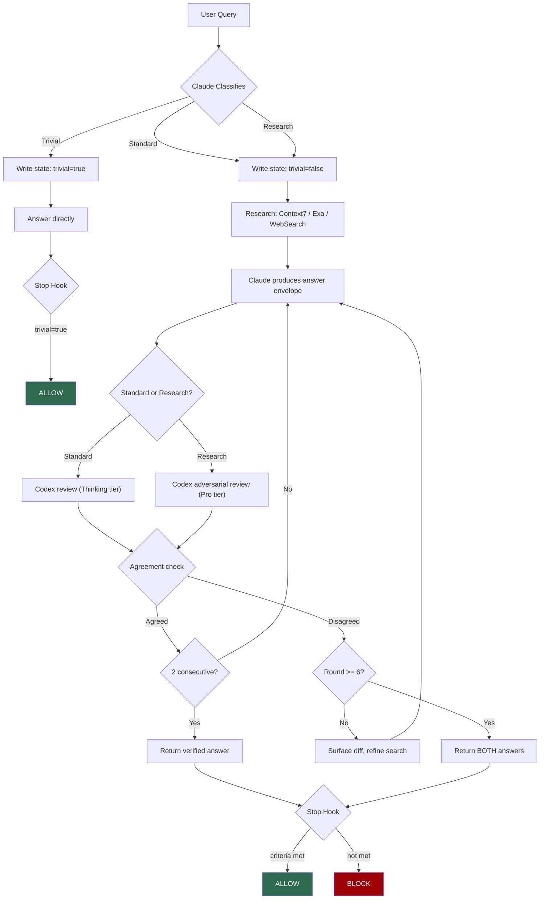
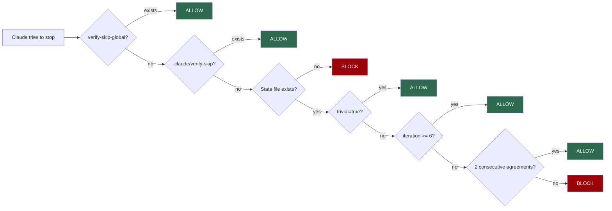
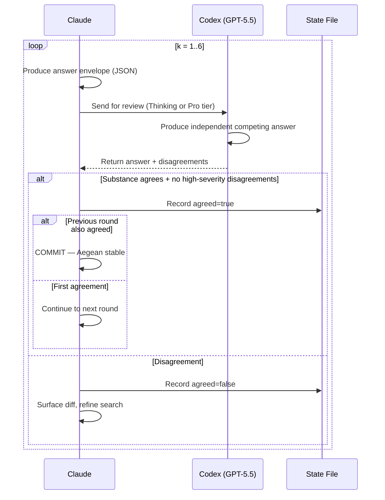

# verify-consensus

> Cross-verify every Claude Code answer with OpenAI Codex. Trust, but verify.

[](LICENSE)
[](https://docs.anthropic.com/en/docs/claude-code)
[](https://platform.openai.com/docs/codex)

---

## What Is This?

Claude Code answers questions, writes code, and makes architectural decisions. But any single AI can hallucinate or confidently state something incorrect.

**verify-consensus** makes OpenAI Codex (GPT-5.5) independently verify every non-trivial answer Claude produces. It enforces a verification loop via Claude Code hooks — Claude literally **cannot finish** a task until verification criteria are met.

### Key principles

- **Aegean stability** — requires **2 consecutive rounds** of agreement between Claude and Codex. One agreement could be coincidental; two consecutive agreements establish genuine consensus.
- **Intelligence-tier mapping** — maps query complexity to GPT-5.5 tiers: Instant (skip), Thinking (standard), Pro+Extended (research).
- **Hard enforcement** — a Stop hook **blocks** Claude from finishing until verified. Not advisory — a gate.
- **Honest disagreement** — if no consensus after 6 rounds, returns **both** answers. Never fabricates consensus.
- **Escape hatches** — multiple bypass mechanisms for when verification is unnecessary.

---

## Architecture



### Hook enforcement flow



---

## File Structure

```
verify-consensus/
├── README.md                         # This file
├── LICENSE                           # MIT License
├── install.sh                        # One-command installer
├── .gitignore
├── hooks/
│   ├── stop-verify-gate.sh           # Stop hook — blocks until verified
│   ├── log-verify-iteration.sh       # Per-iteration JSONL logger
│   ├── log-session-summary.sh        # Session summary on stop
│   └── rotate-logs.sh               # Log rotation on session start
├── skills/
│   └── verify-consensus/
│       └── SKILL.md                  # Core verification loop logic
└── config/
    ├── settings-hooks.json           # Hook config for settings.json
    ├── claude-md-snippet.md          # Policy text for CLAUDE.md
    └── mcp-servers-snippet.json      # MCP server config
```

### File descriptions

| File | Purpose | Install to |
|------|---------|-----------|
| `hooks/stop-verify-gate.sh` | Stop hook — blocks Claude from finishing unless verified. Checks escape hatches, state file, iteration count, agreement history. | `~/.claude/hooks/` |
| `hooks/log-verify-iteration.sh` | Called by skill after each round. Appends JSON to global + project-local logs. | `~/.claude/hooks/` |
| `hooks/log-session-summary.sh` | Runs on Stop after gate. Summarizes session to log, cleans up state file. | `~/.claude/hooks/` |
| `hooks/rotate-logs.sh` | Runs on SessionStart. Rotates logs >10MB. Archives after 30 days. Deletes after 90. | `~/.claude/hooks/` |
| `skills/verify-consensus/SKILL.md` | Core skill — the full classify/research/iterate/terminate loop with JSON formats. | `~/.claude/skills/verify-consensus/` |
| `config/settings-hooks.json` | Hook configuration to merge into your settings.json. | Reference — merge into `~/.claude/settings.json` |
| `config/claude-md-snippet.md` | Verification policy text for Claude's instructions. | Reference — append to `~/.claude/CLAUDE.md` |
| `config/mcp-servers-snippet.json` | MCP server config for Codex + Context7. | Reference — merge into `~/.claude.json` |
| `install.sh` | Copies hooks + skill to `~/.claude/`, checks dependencies. | Run from repo root |

---

## Quick Start

### Prerequisites

| Dependency | Install |
|------------|---------|
| Claude Code CLI | [docs.anthropic.com/claude-code](https://docs.anthropic.com/en/docs/claude-code) |
| OpenAI Codex CLI | `npm install -g @openai/codex` |
| Node.js >= 18 | [nodejs.org](https://nodejs.org/) |
| jq >= 1.6 | `sudo apt install jq` / `brew install jq` |

### Install

```bash
git clone https://github.com/KlementMultiverse/verify-consensus.git
cd verify-consensus
bash install.sh
```

### Manual steps after install

**1. Add hooks to `~/.claude/settings.json`:**

Merge the contents of `config/settings-hooks.json` into your settings file under the `hooks` key.

**2. Add policy to `~/.claude/CLAUDE.md`:**

Append the contents of `config/claude-md-snippet.md` to your global CLAUDE.md.

**3. Add MCP servers to `~/.claude.json`:**

Merge `config/mcp-servers-snippet.json` into the `mcpServers` key.

**4. Login to Codex:**

```bash
codex login
```

**5. Start a new Claude Code session.** The verification gate is now active.

---

## How It Works

### Step 1: Classify

Every query is classified before any answer is generated:

| Classification | Criteria | Examples |
|---------------|----------|---------|
| **Trivial** | Greetings, confirmations, simple lookups | "Thanks!", "What was that command?" |
| **Standard** | Coding, bug fixes, learning questions | "Set up JWT auth in FastAPI" |
| **Research** | Architecture, security, migrations, startup decisions | "Best auth pattern for multi-tenant SaaS" |

Claude writes `.claude/verify-state.json` immediately. Trivial queries skip verification entirely.

### Step 2: Research

For standard/research queries, Claude gathers citations before answering:

- **Context7** first (version-pinned library docs)
- **Exa** for current web info
- **WebSearch** as fallback

Every factual claim must have a fetched URL with a supporting quote.

### Step 3: Iterate (max 6 rounds)



### Step 4: Terminate

- **2 consecutive agreements** -> return verified answer with merged citations
- **6 rounds, still disagreeing** -> return BOTH answers with confidence scores. Never fake consensus.

---

## GPT-5.5 Intelligence Tier Mapping

| Classification | ChatGPT Tier | Codex Command | Use Case |
|---------------|-------------|---------------|----------|
| **Trivial** | Instant | *skip* | Greetings, simple chat |
| **Standard** | Thinking | `/codex:review --wait` | Coding, bug fixes, learning |
| **Research** | Pro (Extended) | `/codex:adversarial-review --wait --effort xhigh` | Architecture, security, research |

If plugin commands are unavailable, falls back to `mcp__codex__codex` MCP tool.

---

## Escape Hatches

All escape hatches are user-controlled. Claude cannot invoke them.

| Method | Scope | Enable | Disable |
|--------|-------|--------|---------|
| Env var | Current session | `CLAUDE_SKIP_VERIFY=1 claude` | Don't set it |
| Global kill | All projects | `touch ~/.claude/verify-skip-global` | `rm ~/.claude/verify-skip-global` |
| Project skip | Current project | `touch .claude/verify-skip` | `rm .claude/verify-skip` |
| All hooks off | Nuclear option | `"disableAllHooks": true` in settings.json | Remove the line |

---

## Observability

### Log files

| File | Content | Per |
|------|---------|-----|
| `~/.claude/logs/verify-gate.jsonl` | Every Stop hook decision (allow/block + reason) | Stop attempt |
| `~/.claude/logs/verify-iterations.jsonl` | Per-round data (agreed, confidence, disagreements) | Iteration |
| `~/.claude/logs/verify-sessions.jsonl` | Session summaries (outcome, iterations, complexity) | Session end |
| `.claude/verify-log.jsonl` | Same as iterations, scoped to current project | Iteration |

### Log rotation

Runs on SessionStart: files >10MB rotate (`file.jsonl` -> `.1` -> `.2` -> `.3`). Archives after 30 days. Deletes after 90.

### Query examples

```bash
# Recent gate decisions
tail -20 ~/.claude/logs/verify-gate.jsonl | jq .

# All blocked stops
cat ~/.claude/logs/verify-gate.jsonl | jq 'select(.action == "block")'

# Sessions that hit 6-round cap
cat ~/.claude/logs/verify-sessions.jsonl | jq 'select(.outcome == "capped")'

# Trivial vs verified breakdown
cat ~/.claude/logs/verify-sessions.jsonl | jq -s '{
  total: length,
  trivial: [.[] | select(.trivial == true)] | length,
  verified: [.[] | select(.trivial == false)] | length
}'

# Average iterations for non-trivial queries
cat ~/.claude/logs/verify-sessions.jsonl | jq -s '
  [.[] | select(.trivial == false) | .iterations] | add / length
'
```

---

## State File Format

Written to `.claude/verify-state.json` by Claude, read by the Stop hook.

### Trivial

```json
{
  "question": "what is 2+2",
  "complexity": "trivial",
  "trivial": true,
  "reason": "simple arithmetic",
  "ts": "2026-05-13T15:00:00Z"
}
```

### Non-trivial (agreed after 3 rounds)

```json
{
  "question": "best auth pattern for SaaS MVP",
  "complexity": "standard",
  "trivial": false,
  "iteration": 3,
  "history": [
    {"round": 1, "agreed": false, "claude_summary": "JWT", "codex_summary": "session-based"},
    {"round": 2, "agreed": true, "claude_summary": "JWT+refresh", "codex_summary": "JWT+refresh"},
    {"round": 3, "agreed": true, "claude_summary": "JWT+refresh", "codex_summary": "JWT+refresh"}
  ],
  "outcome": "agreed",
  "ts": "2026-05-13T15:10:00Z"
}
```

### Non-trivial (capped at 6, no consensus)

```json
{
  "question": "monolith vs microservices for 3-person startup",
  "complexity": "research",
  "trivial": false,
  "iteration": 6,
  "history": [
    {"round": 1, "agreed": false, "claude_summary": "monolith first", "codex_summary": "modular monolith"},
    {"round": 2, "agreed": true, "claude_summary": "modular monolith", "codex_summary": "modular monolith"},
    {"round": 3, "agreed": false, "claude_summary": "modular monolith + events", "codex_summary": "strict monolith"},
    {"round": 4, "agreed": false, "claude_summary": "monolith + queue", "codex_summary": "monolith only"},
    {"round": 5, "agreed": true, "claude_summary": "monolith, extract later", "codex_summary": "monolith, extract later"},
    {"round": 6, "agreed": false, "claude_summary": "monolith + feature flags", "codex_summary": "monolith, no flags"}
  ],
  "outcome": "capped",
  "ts": "2026-05-13T16:00:00Z"
}
```

---

## How Agents Can Adopt This

The verify-consensus pattern is framework-agnostic. Any AI system can use model-vs-model verification:

1. **Primary model** generates an answer
2. **Reviewer model** (different provider) independently generates a competing answer — not a critique, a complete answer
3. **Agreement check** compares substance, claims, and citations
4. **Aegean stability** — 2 consecutive agreements required (prevents coincidental agreement)
5. **Honest cap** — fixed round limit, return both answers if no consensus

The key insight: **cross-provider verification catches errors that same-provider verification misses**. Two models with different training data, architectures, and failure modes are far more likely to catch each other's hallucinations.

---

## License

[MIT](LICENSE)
